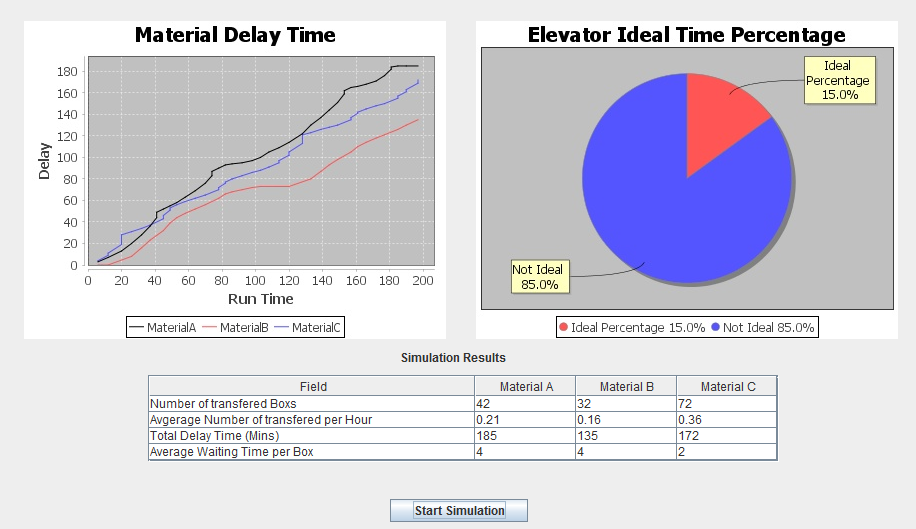

# Elevator Simulator
It's a simulator that transfers 3 diffrent kinds of Materials. 
Here is the problem statment: 
 

 
Assumptions: 
Run Time= 200Hours, 
Max Weight= 400KG. 

Here are how the results should look like: 

